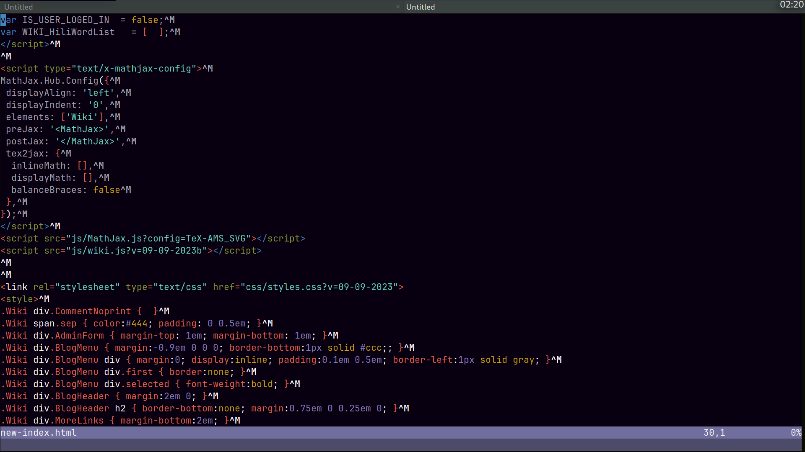
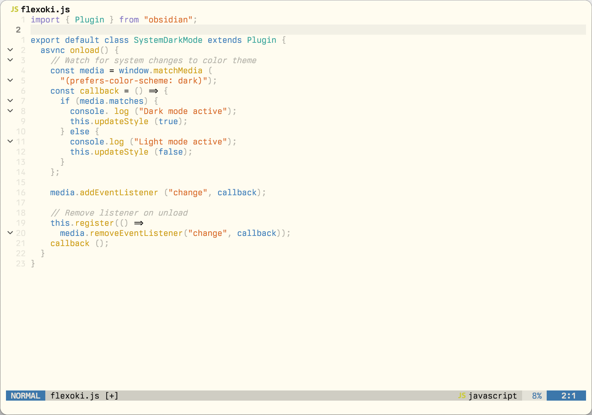

# aetherwind-neovim
Aetherwind color scheme

<!--  -->
## Installation
To install simply add via your plugin manager and call the theme

**[lazy.nvim](https://github.com/folke/lazy.nvim)**

```lua
require("lazy").setup({
  { 'aetherbird/aetherwind-neovim', name = 'aetherwind' }
})
```

**[packer.nvim](https://github.com/wbthomason/packer.nvim)**

```lua
require('packer').startup(function(use)
  use({ 'aetherbird/aetherwind-neovim', as = 'aetherwind' })
end)
```

**[Paq](https://github.com/savq/paq-nvim)**

```lua
require('paq')({
  { 'aetherbird/aetherwind-neovim', as = 'aetherwind' }
})
```

## Usage

* Dark

```lua
-- Set colorscheme after options
vim.cmd('colorscheme aetherwind-dark')
```

* Light

```lua
-- Set colorscheme after options
vim.cmd('colorscheme aetherwind-light')
```
